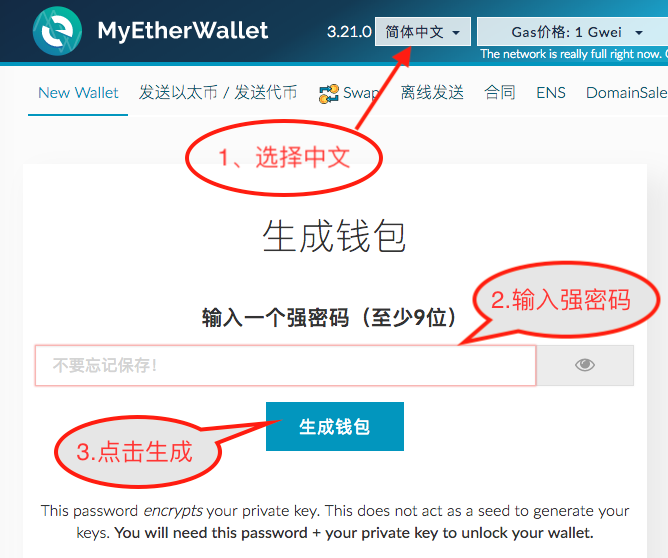
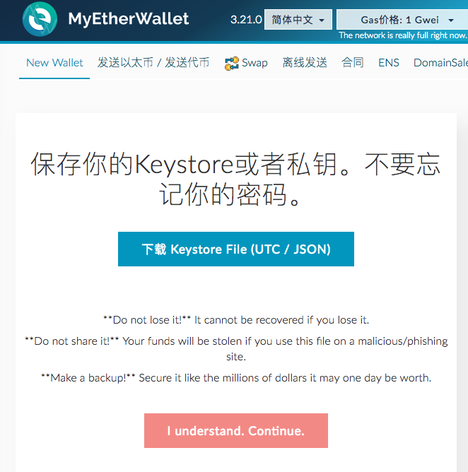
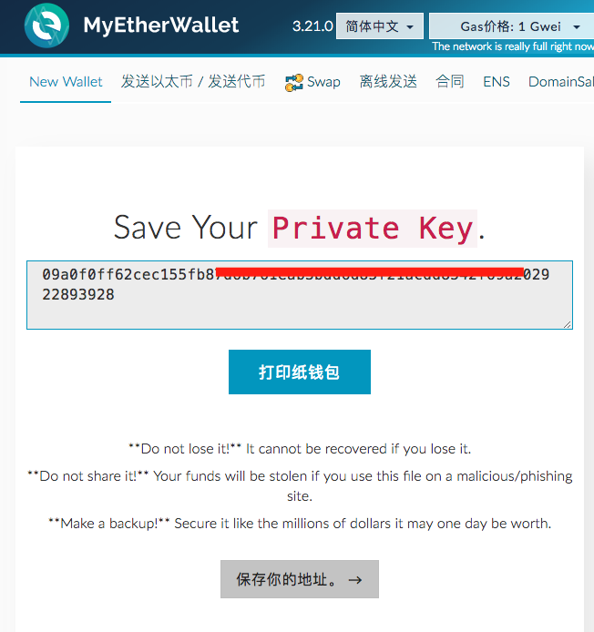
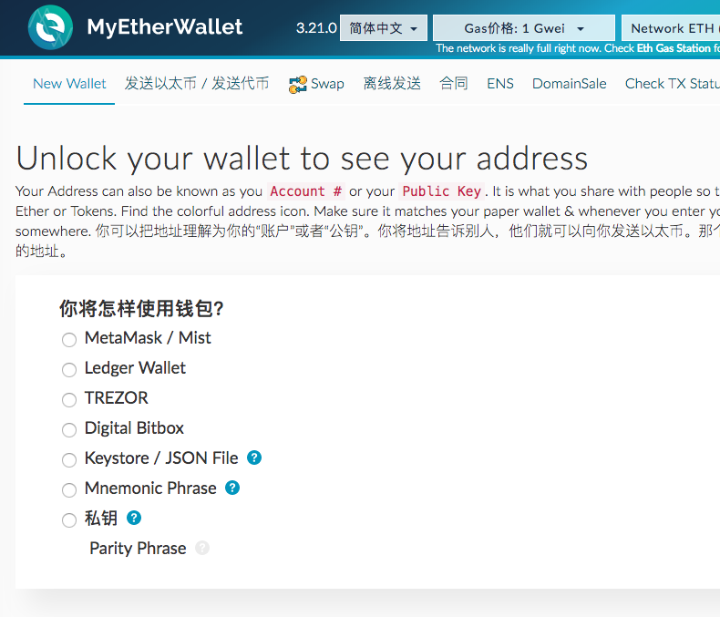
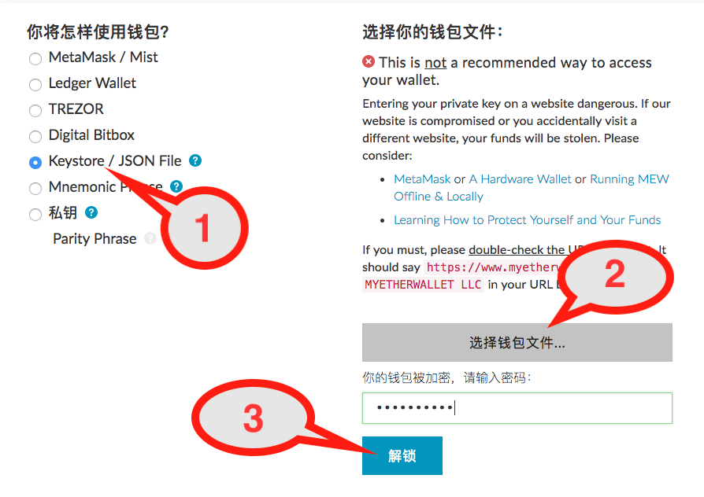
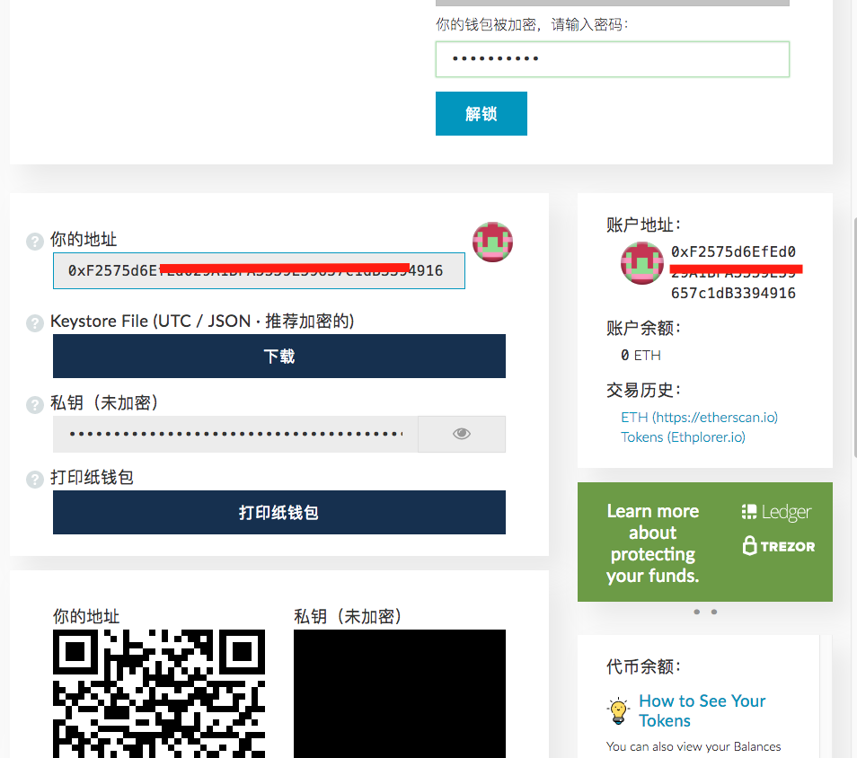
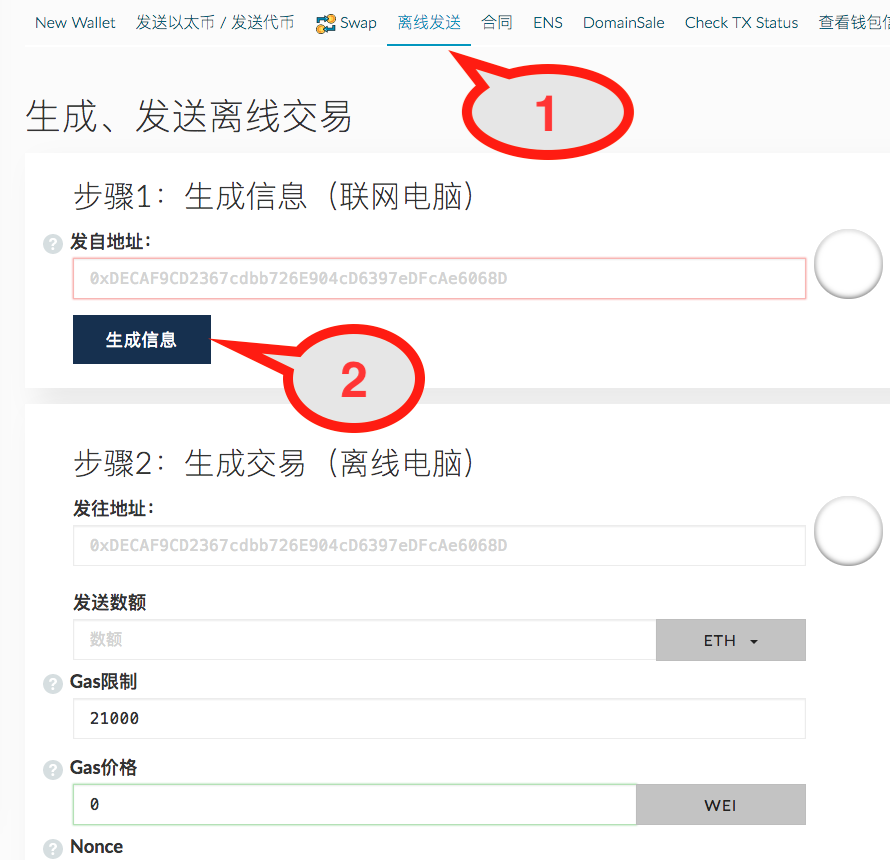
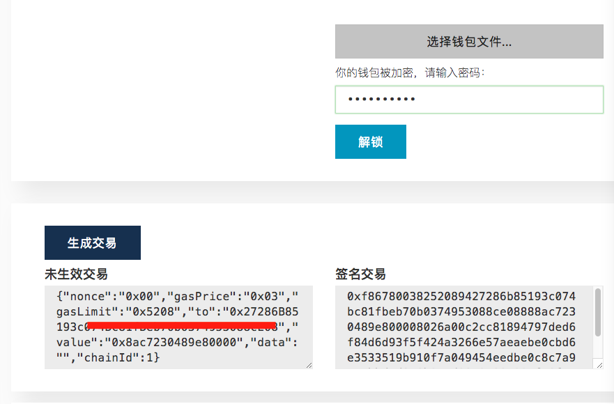
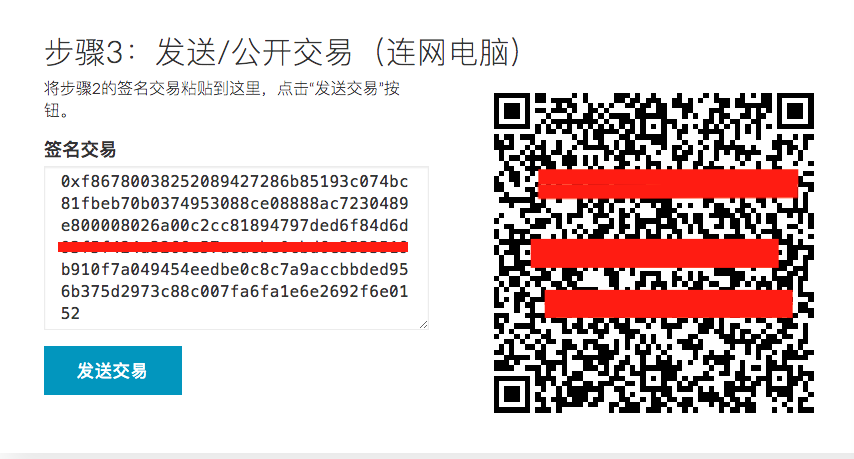

### 如何设置 MyEtherWallet 冷钱包

今天给大家介绍一个不使用硬件钱包，但安全性能并不比硬件钱包差的 MyEtherWallet 冷钱包的设置和使用方法。

### MyEtherWallet 简单介绍

MyEtherWallet 的网页钱包使用非常简单，打开网页就可以使用，源代码开源，不会在服务器上存储用户的钱包信息如私钥和密码。支持 Ledger Wallet、TREZOR 等硬件钱包，功能极为丰富。是一把我们经常会用到的瑞士军刀！

### 什么是冷储存？

冷储存（Cold storage）是指将钱包离线保存的一种方法。我们可以在一台离线的电脑或手机上生成地址和私钥，并将其妥善保存起来。这台电脑或手机以后就保持离线，永远不要连接网络！来确保私钥的安全。

### 冷钱包使用原理

看到这里，大家可能就会产生一个关键的问题：那就是我们的区块链是基于互联网之上的，所有网络价值的转移都是需要通过联网将数据发到相应的区块链上。冷储存是离线的，根本不联网，那该如何实现价值转移呢？这里主要通过收币和发币这两个主要环节，来简要说明：

* **收币**：收币其实根本用不到冷钱包，因为区块链的是一个公共的帐本，**币本质上并不是发到你的钱包上的！！（很多人都会有这个误解）**。只是公共帐本上有收到币的记录就 OK 了。你只需把钱包的地址告诉对方。对方发送后，到 https://etherscan.io 上去查看一下，看是不是收到就 ok 了。还可以在 etherscan.io 上注册个帐户，象我一样，把你常用的收款地址加入 Watch List , 如果有收到币，系统会发邮件通知你，你也可以随时登陆网站查看自己帐户上各个通证的余额。

* **发币**：稍麻烦一点，在冷钱包上生成交易信息，然后进行签名，最后把签名后的代码拿到联网的电脑或手机上，通过它们把交易信息公布到区块链上。接着就等矿工打包确认了。

### 让我们一起来一步步设置起来

1. 设置安全电脑或手机

   准备一台不用的电脑或手机用来制作冷钱包。
   然后在另外联网的电脑上
  打开网址：[https://github.com/kvhnuke/etherwallet/releases/latest](https://github.com/kvhnuke/etherwallet/releases/latest)，下载 etherwallet-vX.X.X.X.zip 文件，然后将这个文件拷贝到冷钱包电脑上。解压。

2. 生成钱包
   在冷钱包电脑上用浏览器打开 `index.html`。

   

3. 备份钱包

   

   * 下载 keystore 文件，将它拷贝到 U 盘备份。 这个 U 盘只在冷钱包的电脑上专用，以后不要在其它电脑或地方使用。

   * 备份后，点击 I understand, Continue 按钮。

   

   * 手抄下私钥，以备万一，如备份 keystore 的 U 盘坏了等情况。
     也可以点击打印，如果你没有打印机，可以保存为 PDF 格式。

   * 点一下保存你的地址。回到以下界面：
     

4. 测试冷钱包

  * 钱包地址
    
    1. 选择 keystore / JSON File .
    2. 点选择钱包文件，选择备份的 keystore 文件。
    3. 输入密码，点解锁。
    
    4. 就会显示出钱包地址等信息。
    5. 将地址拷贝到联网的电脑上，可以通过另外一个 U 盘或者扫描二维码来进行，为防止出错尽量不使用手写记录。
  * 接收以太币
    可以从其它地方发送一个很小的金额如 0.0001 ETH 到这个地址。看看有没问题。
  * 发送以太
    
    1. 在联网的电脑上选择离线发送
    2. 输入接收方地址后点生成信息
    3. 在离线电脑上同一个地方输入生成的交易信息
       
    4. 解锁钱包后，点生成交易。
    5. 把签名交易中的内容复制到放有地址的 U 盘。
       
    6. 在联网的电脑上复制签名交易信息，然后点发送交易，交易就将广播到区块链网络上。

### 结束语

到这里冷钱包的制作和使用就已经完成了，如果为了进一步确保安全，作为冷钱包的电脑使用前需要重装系统（系统最好使用安全的离线系统，如 Tails），手机要求使用原生系统，不安装其它任何软件。大家在如果在钱包的使用上有什么问题，可以回复，如果我能解答的，将及时回复。
