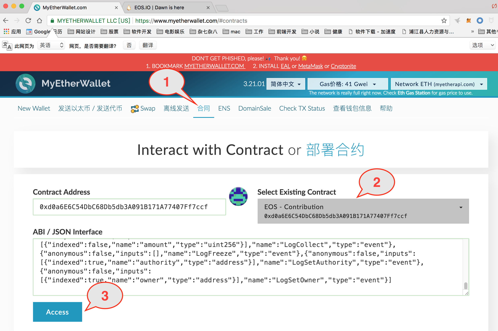
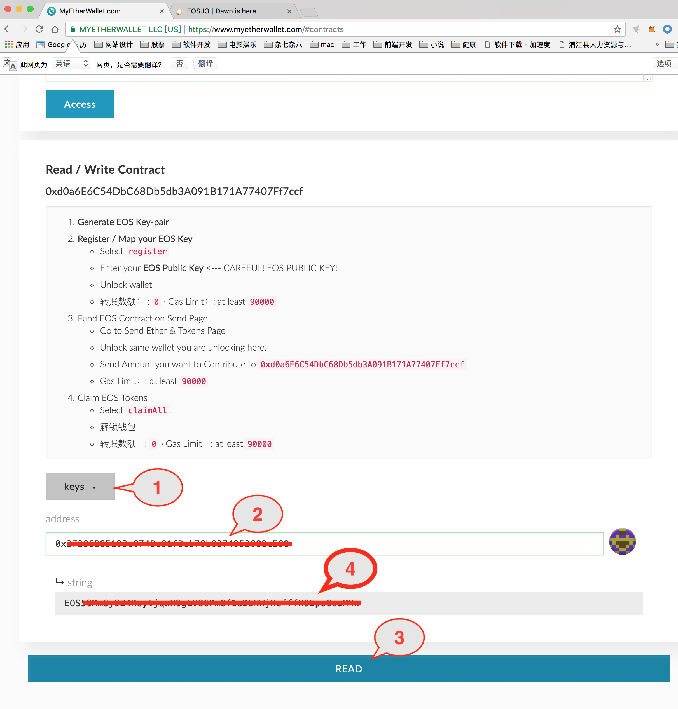

### 如何验证 eos 是否映射成功及验证私钥的正确性

#### 验证 eos 是否映射成功

今天在群里看到很多人在问如何验证 eos 是否映射成功，这个在官网上有说明，比较简单，只要有映射的地址和公钥就可以了。
技术点的说法是调用 eos 智能合约的 keys 函数，参数为地址，如果这个地址已经做过映射，则会返回对应的公钥。对照一下公钥是不是一样就可以了。
下面我以 MyEtherWallet 为例说明一下：

#### 打开 EOS 合约

 

 1. 打开 https://www.myetherwallet.com 点 Contracts , 如果设了语言为中文的话，点合同。

 2. 在 Select Existing Contract 这里下接菜单中选择 EOS - Contribution

 3. 点击 Access

#### 调用合约函数



1. 选择 keys 函数
2. 输入地址
3. 点击 READ 按钮
4. 在这里查看有没有出现公钥及公钥是不是正确无误。

这个方法是安全的，因为只需要地址和公钥，不会露私钥。

### 验证私钥的正确性

在映射后，很多人还是会担心：当时抄的密钥会不会抄错？验证的方法是有的。不过因为验证要用到私钥，所以要十分注意安全，**安全的电脑以及使用时不要联网都是必须的**。验证后私钥也不能保存在电脑里，要及时清除。如果没有安全的电脑，我觉得这个操作风险就太大了，不建议进行。

原理：就是用 EOS 命令行工具将私钥导入钱包，然后对照一下生成的私钥、公钥对是否一致。`eosioc wallet import 私钥 `

### 详细操作步骤

* 编译源码

如果没有 EOS 程序，就需要编译源码生成，下面简单的讲解下如何编译 EOS 源码，今天我在实际操作时，发现如今的 EOS 编译过程比以前简单多了，现在可以直接一个命令搞定，不再需要以前的很多准备工作了！

```sh
git clone https://github.com/eosio/eos --recursive
cd eos
./eosio_build.sh
```

* 准备运行参数

 `cd build/programs/eosiod/`

在当前目录下编辑 `config.ini`文件，把以下内容加入：

```python
genesis-json = /path/to/eos/source/genesis.json
# Enable production on a stale chain, since a single-node test chain is pretty much always stale
enable-stale-production = true
# Enable block production with the testnet producers
producer-name = inita
producer-name = initb
producer-name = initc
producer-name = initd
producer-name = inite
producer-name = initf
producer-name = initg
producer-name = inith
producer-name = initi
producer-name = initj
producer-name = initk
producer-name = initl
producer-name = initm
producer-name = initn
producer-name = inito
producer-name = initp
producer-name = initq
producer-name = initr
producer-name = inits
producer-name = initt
producer-name = initu
# Load the block producer plugin, so you can produce blocks
plugin = eosio::producer_plugin
# Wallet plugin
plugin = eosio::wallet_api_plugin
# As well as API and HTTP plugins
plugin = eosio::chain_api_plugin
plugin = eosio::http_plugin
```
* 本地运行 eosiod

 `./eosiod --config-dir ./`

* 进入 eosioc 目录

 `cd ../eosioc/`

* 新建 EOS 钱包

 ```sh
 ./eosioc wallet create

 Creating wallet: default
 Save password to use in the future to unlock this wallet.
 Without password imported keys will not be retrievable.
 "PW5JYqQdCMMyNZnqFfgNZp......cFcRNUtYr9n2qwxR4ZGX"
 ```
* 解锁钱包
```sh
./eosioc wallet unlock
password: 输入上个步骤中新建钱包后输出的密码
Unlocked: default
```
* 导入私钥
```sh
./eosioc wallet import 5JQHMm......J5oS
imported private key for: EOS6cn8E4xVRfGzw.......MwDnuUPZ4z8vwtC
```
可以看到有对应的公钥出来，如果能跟映射生成的公钥相同，则私钥是正确的。

* 列出钱包的公钥和私钥
```sh
./eosioc wallet keys
[[
    "EOS6cn8E4xVRfGzw......MwDnuUPZ4z8vwtC",
    "5JQHMm......J5oS"
  ]
]
```
好了，用完记得删除 build/var/lib/eosio/node_00/./default.wallet 这个钱包文件
