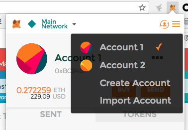

## 如何取消以太坊交易

2017年以来，以太坊网络就经常堵，ico 堵，以太猫堵，用户多堵。设置的 Gas price (Gas 价格)  太小，有时几天也到不了帐，太高，高额转账手续费让人心痛。这里我们不谈如何解决拥堵问题，那是技术人拿们的事。吃瓜群众关心的是：当一笔交易堵在那里，一直等待打包的时候，我们能做些什么，能取消交易吗？能提高交易费让交易尽快到账吗？答案是肯定的，我来给大家详细做个介绍。

### 以太 GAS 机制介绍

我还是先从以太的 Gas 机制来说明，如果对这些不感兴趣，也可以直接跳到解决方法。但是了解一下这些内容也是非常有好处的，会让你以太坊交易机制有一个进一步的深入理解，还可以让你明白怎么设 Gas 价格，设多少合理等等问题，让你直接从吃瓜群众进化到高大上的专业人士。

### 需要知道的几个概念：

任何以太坊区块链上的操作，不管是向普通地址转账还是向合约转账，都是需要 gas 的。

* 旷工费：转账时需要额外支付给以太坊网络旷工的费用。
* Gas 价格： 转账等操作时每一步操作的单价，单位一般为 GWei。
* Gas Limit（Gas 限制）：转账操作时最大允许消耗的 Gas，如果转帐执行时所消耗的 Gas 大于 Gas 限制，转帐就会失败，并且执行时消耗的 Gas 还是会扣除，所以这一项可以适当填大点，并且对交易费没有影响，除非智能合约设计不合理，出现死循环等现象。

旷工费  = Gas 价格 \* 实际消耗的 Gas

实际消耗的 Gas ： 取决于所运行智能合约操作的消耗，不由我们决定。如转账给普通地址一般需要 21000 个 gas。

从旷工费的公式中可以看出，Gas 价格高，所得的旷工费就高，所以矿工都是优先打包 Gas 价格高的交易。这样当交易堵的时候， Gas 价格比较低的会竞争不过 Gas 价格高的交易，后果就是很长时间不到帐，我曾有一笔交易 5 天了还没到帐，虽然随着时间过去，矿工优先打包这个交易的权重也会有所增加，但是在网络拥堵的时候，这个影响还是微乎其微的。

### 如何设置 Gas 价格

我们可以根据当前以太网络拥堵程度来设置 Gas 价格：
* https://www.etherchain.org/tools/gasPriceOracle 在这里可以看到当前不同 Gas 价格所需要的交易确认时间估算，我们可以通过这个来确定所使用的 Gas 价格。
* https://ethgasstation.info/index.php 这个网站有详细的有关 Gas Gas 价格的信息。

### 取消或加速交易的原理

让我们首先研究下以太坊的交易的详细情况：

下图是 ethscan 显示的一笔交易的详细内容：

大家可能会注意到，其中有一项为 Nonce: 39 , **那么 Nonce 是什么呢，有什么意义？**

### Nonce 是什么？

以太坊中，每笔交易都有一个 nonce , nonce 是发送地址发送交易的笔数。
每次发次一笔交易，nonce 加 1，以太坊有关  nonce 的规则如下：
* 按**交易顺序**， nonce 为 1 的交易只能在 nonce 为 0 交易后面，而不能在 nonce 为 0 的交易前面被矿工确认。
* nonce 是**连续**的，不能跳过。如果 nonce 为 0 或 1 的交易还没有发送过，你就不能发送 nonce 为 2 的交易。

### 解决方法

根据 nonce 的这个特性，我们就可以取消或重新发送交易。

**取消交易**就是用同样的 nonce 值，重新发送一笔交易，可以把**转帐金额设为0**，**目标地址可以设为自己的发送地址**，就是说发送地址和目标地址相同。

如果需要重新发送交易，我们就可以用上一个交易相同的 nonce , 但**使用更高的 Gas 价格来加速确认**，这个交易确认后，原来的交易就会自动取消。因为以太网络不会去重复确认跟已经确认的交易有相同 nonce 值的交易。

很简单是吧，但是很多钱包软件是没有设置 nonce 值的功能的。我目前只知道 https://www.myetherwallet.com/ 有这个功能。如果你使用 myetherwallet 支持的**硬件钱包**，或者 metamask, 可以直接 myetherwallet 。

但是如果你使用的是 imtoken 钱包，一种方法是导出 Keystore , 然后在 myetherwallet 中导入。但导出私钥存在有风险，万一你不小心用了不正确的 myetherwallet 网址，很容易被盗，所以推荐用后一种方法。就是在 google 浏览器中安装 metamask 插件, 然后导入 imtoken 的 keystore 文件。

在 metamask 中点一下菜单，选 Import Account 导入 imtoken 的 keystore.

### 实际操作图示

以下以 metamask 为例示范操作一下：

1. 打开网站 https://www.myetherwallet.com/ ， 注意请确认网址。
2. 可以在这里选择语言为中文

3. 选择离线发送

* 步骤1：生成信息（联网电脑）

  输入发自地址，后点击生成信息，系统会根据自动填入 Gas 价格，和下一交易使用的 Nonce 值。

  

* 步骤2：生成交易（离线电脑）

 一一填好发往地址、发送数额、发送的代币、Gas 限制、Gas 价格、 Nonce 等。

 

 * 如果要取消交易，可以将发送数额真为 0 ，
 * 如果要加速堵塞的交易，则设较高的 Gas 价格，其它数据跟原来的交易一样。**Nonce 设为你要加速、取消或替换的交易对应值**。

 **注意** *Gas 价格这里 Wei 作单位，如果 Gas 价格为 41 则这里输入 41000000000，注意后面有5个0.*

* 步骤 2.5  

 选择 MetaMask / Mist

 

点击 Connect to MetaMask。

* 步骤 2.8

 点击“生成交易” 会生成末生效交易、签名交易。
 

* 步骤3：发送/公开交易（连网电脑）

 最后点击发送交易，等矿工确认这条交易，原来具有相同 nonce 的末确认交易就会取消。
 

*注意：图示中的交易数据只为示范用，并不是实际数据。*

参考资料：

* [ICO直投技巧（提前量，Gas Price&Gas Limit设置）](https://www.jianshu.com/p/7308f0b10016) - 大硕简书
* [从以太坊网络拥堵说起](https://www.jianshu.com/p/7cc32f212a1d) - 区块链生存指南
* [以太坊区块链被猫咪堵住](https://cn.bitcoin.com/archives/5678) - Kai Sedgwick
* [What is Nonce?](https://myetherwallet.github.io/knowledge-base/transactions/what-is-nonce.html) -  MyEtherWallet
* [Cancel pending transactions on Ethereum](https://jakubstefanski.com/post/2017/10/ethereum-cancel-pending-transaction/) - Jakub Stefanski
